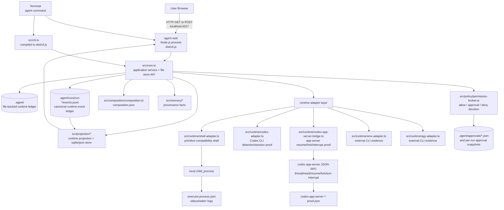
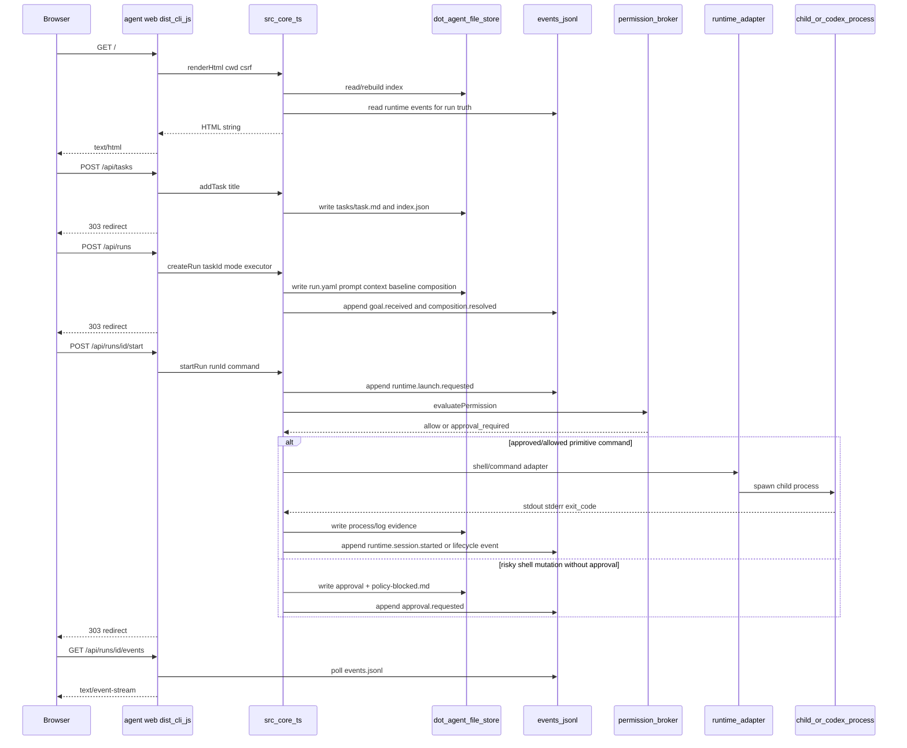
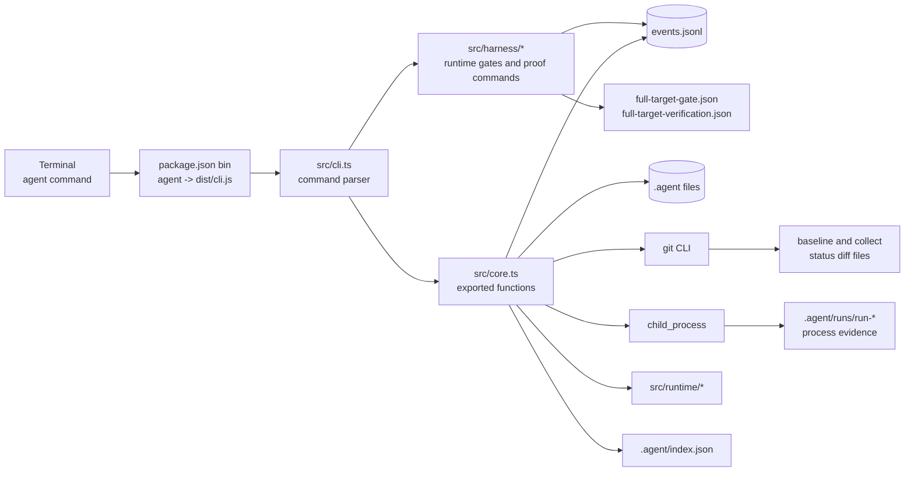
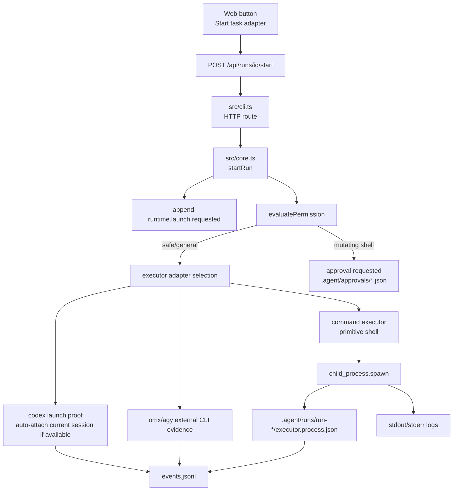
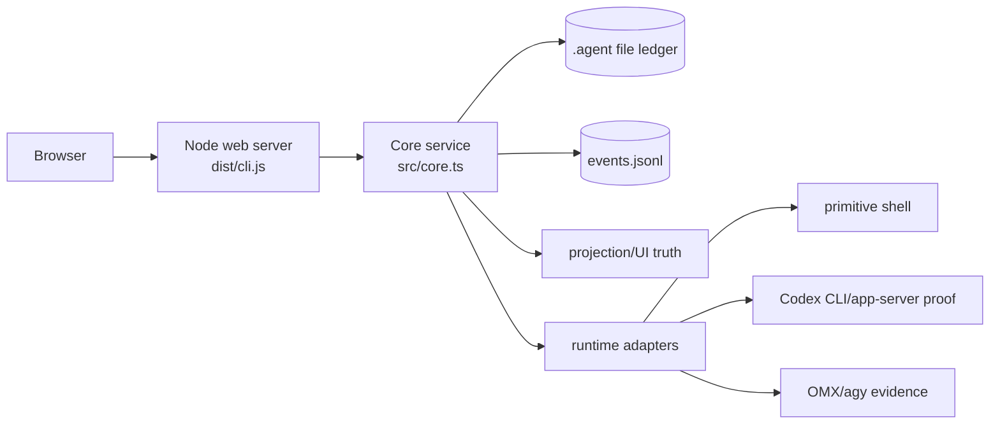
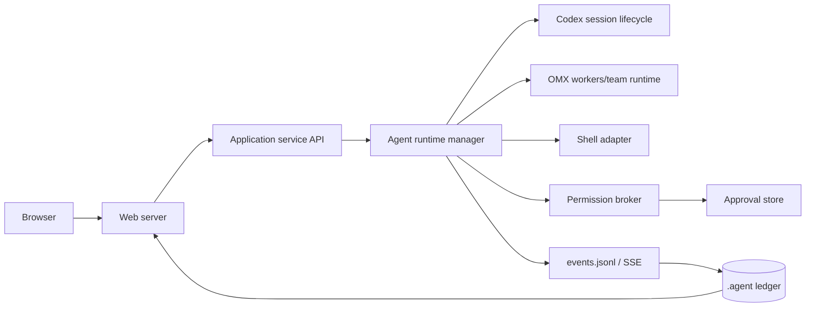

# Dominic Orchestration Physical Runtime Architecture

**Last reviewed:** 2026-06-02
**Review result:** 구현은 최초 문서의 “missing runtime adapter” 상태를 넘어섰지만, 현재 product gate는 **FAIL / completion ceiling 60**이다. live smoke와 verifier 계열 증거는 존재하나, signed independent-review provenance가 없으므로 completion-candidate/90/95 claim은 금지된다. hosted/SaaS/remote daemon/범용 MCP 플랫폼은 여전히 범위 밖이다.

> VSCode Mermaid extension 렌더링 기준으로 작성했다.
> Mermaid label 안의 줄바꿈은 `\n` 대신 `<br/>`를 쓴다.
> node label은 전부 `ID["label"]` 형태로 감쌌다.

## 1. 현재 실제 물리 구조



## 2. 현재 Web 요청 흐름



## 3. 현재 CLI 실행 흐름



## 4. 실제 파일 결합 지도

```mermaid
flowchart TD
    Package["package.json<br/>bin.agent = ./dist/cli.js"] --> DistCLI["dist/cli.js"]
    TsConfig["tsconfig.json"] --> DistCLI

    SrcCLI["src/cli.ts"] --> SrcCore["src/core.ts"]
    SrcCore --> Events["src/events/ledger.ts"]
    SrcCore --> Projection["src/projection/projection.ts<br/>src/projection/sqlite-store.ts"]
    SrcCore --> Policy["src/policy/permission-broker.ts"]
    SrcCore --> Composition["src/composition/composition.ts"]
    SrcCore --> Memory["src/memory/fabric.ts<br/>src/memory/records.ts"]
    SrcCore --> Runtime["src/runtime/*"]

    SrcCLI --> Harness["src/harness/*"]
    Harness --> Events
    Harness --> Runtime
    Harness --> Memory

    Runtime --> RuntimeTypes["src/runtime/types.ts"]
    Runtime --> CodexBridge["src/runtime/codex-app-server-bridge.ts"]

    SrcTest["src/core.test.ts<br/>src/runtime-architecture.test.ts"] --> SrcCore
    SrcTest --> Events
    SrcTest --> Runtime
    SrcTest --> Harness

    SrcCore --> AgentProject[".agent/project.yaml"]
    SrcCore --> AgentTasks[".agent/tasks/*.md"]
    SrcCore --> AgentRuns[".agent/runs/run-*"]
    AgentRuns --> RunEvents["events.jsonl"]
    AgentRuns --> RunArtifacts["composition / proof / gate artifacts"]
    SrcCore --> AgentApprovals[".agent/approvals/*.json"]
    SrcCore --> AgentIndex[".agent/index.json"]
    SrcCore --> ProductGateFiles[".agent/product-gates/*.json"]
    SrcCore --> ReviewGateFile[".agent/independent-review-gate.json"]
```



## 5. `.agent` 런타임 저장소 구조

```mermaid
flowchart TD
    AgentRoot[(".agent/")] --> ProjectYaml["project.yaml"]
    AgentRoot --> IndexJson["index.json"]
    AgentRoot --> Policies["policies/*.yaml"]
    AgentRoot --> Tasks["tasks/task-*.md"]
    AgentRoot --> Runs["runs/run-*"]
    AgentRoot --> Approvals["approvals/approval-*.json"]
    AgentRoot --> ProductGates["product-gates/product-gate-*.json"]
    AgentRoot --> ReviewGate["independent-review-gate.json"]
    AgentRoot --> ReviewArtifacts["reviews/ and review-gates/"]
    AgentRoot --> LiveSmoke["live-integration-smoke.json"]
    AgentRoot --> Reconcile["reconciliation.json"]
    AgentRoot --> RuntimeProjection["runtime-projection.json / sqlite projection"]
    AgentRoot --> MemoryFabric["memory-fabric.jsonl"]

    Runs --> RunYaml["run.yaml"]
    Runs --> Prompt["prompt.md"]
    Runs --> Context["context.md"]
    Runs --> Baseline["baseline-status.txt<br/>baseline-diff.patch"]
    Runs --> Events["events.jsonl"]
    Runs --> Composition["composition.json"]
    Runs --> Command["executor-command.txt"]
    Runs --> ProcessJson["*.process.json"]
    Runs --> Logs["*.stdout.log<br/>*.stderr.log"]
    Runs --> Collect["collect-status.txt<br/>collect-diff.patch<br/>diff.patch"]
    Runs --> Review["review.md<br/>next-actions.md<br/>result.md"]
    Runs --> RuntimeProofs["codex-launch-proof.json<br/>codex-app-server-*-proof.json"]
    Runs --> FullGate["full-target-gate.json<br/>full-target-verification.json"]
    Runs --> UiSmoke["ui-render-smoke.json"]
    Runs --> M8Evidence["m8-boundary-evidence*.json"]
```



## 6. 현재 실행 레이어



현재 기본 실행은 여전히 compatibility shell이다.

```text
node -e "console.log('Dominic Orchestration task adapter executed')"
```

단, 이것은 더 이상 전체 런타임의 전부가 아니다. 현재 구현은 primitive shell을 명시적으로 낮은 등급으로 표시하고, Codex/OMX/agy adapter evidence와 `events.jsonl` 기반 projection/gate를 별도 레이어로 기록한다.

## 7. Agent Runtime Adapter 구현 상태

| 영역 | 현재 구현 | 구현률 리뷰 |
| --- | --- | --- |
| Adapter contract | `src/runtime/types.ts`에 launch/attach/stream/approve/interrupt/resume/fork 계약 존재 | 약 80%: 계약은 명확하나 모든 adapter가 모든 verb를 first-class로 구현하지는 않음 |
| Shell adapter | `src/runtime/shell-adapter.ts`, command-backed process evidence | PRD local compatibility에는 충분, full agent lifecycle은 의도적으로 미충족 |
| Codex CLI adapter | `src/runtime/codex-adapter.ts`, CLI detection/current transcript proof | 약 70%: launch/attach/stream proof는 가능하나 approve 등은 unproven |
| Codex app-server bridge | `src/runtime/codex-app-server-bridge.ts`, `thread/resume`, `thread/fork`, `turn/interrupt` + `thread/read` 검증 | 약 85%: target run에서 resume/fork/interrupt PASS. 일반 상시 session manager까지는 아님 |
| OMX adapter | `src/runtime/omx-adapter.ts` via `ExternalCliAdapter` | 약 45%: CLI 존재/버전/launch evidence 중심, team runtime deep integration은 아님 |
| agy adapter | `src/runtime/agy-adapter.ts` via `ExternalCliAdapter` | 약 45%: 외부 CLI evidence와 unproven 정직 기록 중심 |
| Event stream | `events.jsonl`, `/api/runs/:id/events` SSE, projection | 약 85%: canonical ledger/projection/UI link 구현. long-lived production bus는 아님 |
| Permission broker | `src/policy/permission-broker.ts`, approval records, runtime action approval chain | 약 80%: 핵심 allow/approval/deny와 artifact chain 구현. 범용 tool sandbox policy engine은 아님 |
| Full target verifier | `src/harness/full-target-gate.ts`, `full-target-verifier.ts`, `runtime-gate.ts` | writer gate와 verifier gate 분리, `gate.full_target.verified`가 authoritative |

## 8. 현재 구조 vs 의도 구조

### Current



### Intended / Not universal yet



## 9. 최종 물리 평가

현재 물리 아키텍처는 더 이상 단순히 “monolithic core + child_process wrapper”가 아니다.

```text
Browser / CLI
→ Node web server and CLI entrypoint
→ src/core.ts application service
→ .agent file ledger
→ canonical events.jsonl ledger
→ projection/UI truth layer
→ permission/approval broker
→ runtime adapter layer
→ primitive shell + Codex proof bridge + OMX/agy evidence adapters
→ harness gates and independent verifier artifacts
```

### 구현된 것

- local CLI/Web control plane
- `.agent` file-backed durable state
- process-backed execution evidence
- event ledger and projection
- SSE event endpoint
- permission/approval chain
- composition and memory provenance artifacts
- Codex app-server lifecycle proof for resume/fork/interrupt on target evidence run
- M8/full-target gate and separate verifier
- product gate fail-closed evidence: live smoke/reconciliation pass, but signed independent-review provenance is absent

### 아직 아닌 것

```text
Hosted SaaS
remote daemonized workers
full custom Agents SDK runtime
broad MCP tool runtime
automatic git push/deploy
always-on OMX team runtime control plane
browser-client E2E guarantee beyond server-render smoke
```

## 10. 구현률 요약

- **PRD-scoped local v0-v2 product:** 현재 보고 가능한 상태는 **completion ceiling 60 / FAIL-CLOSED**. live smoke와 주요 로컬 control-plane 증거는 통과하지만, signed independent-review provenance가 없어서 90/95 claim은 금지된다.
- **이 문서의 최초 “physical runtime architecture” 목표:** 약 **75~85% 구현**. adapter/event/permission/projection/proof는 존재하지만 OMX/agy는 first-class lifecycle이 아니고 UI E2E는 server-render smoke 수준이다.
- **범용 최종 agent platform:** 약 **45~55% 구현**. hosted/remote/SDK/MCP/auto-deploy 범위는 의도적으로 제외되었거나 미구현이다.

### 다음 물리 아키텍처 갭

1. signed independent-review provenance를 reviewer/CI-owned key custody로 운영화.
2. `gate.full_target.verified`를 문서와 운영 절차의 authoritative completion event로 고정.
3. fresh target run으로 과거 noisy events 없이 최종 evidence 재생성.
4. Browser/Playwright 기반 실제 `agent web` run detail + SSE E2E smoke 추가.
5. OMX/agy adapter를 detection/evidence 수준에서 session lifecycle 수준으로 확장할지 별도 PRD로 결정.
